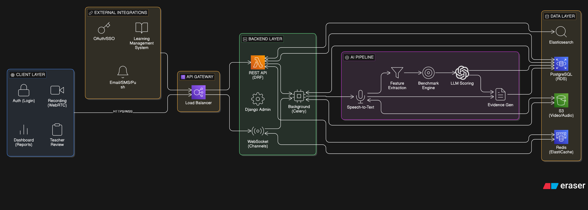
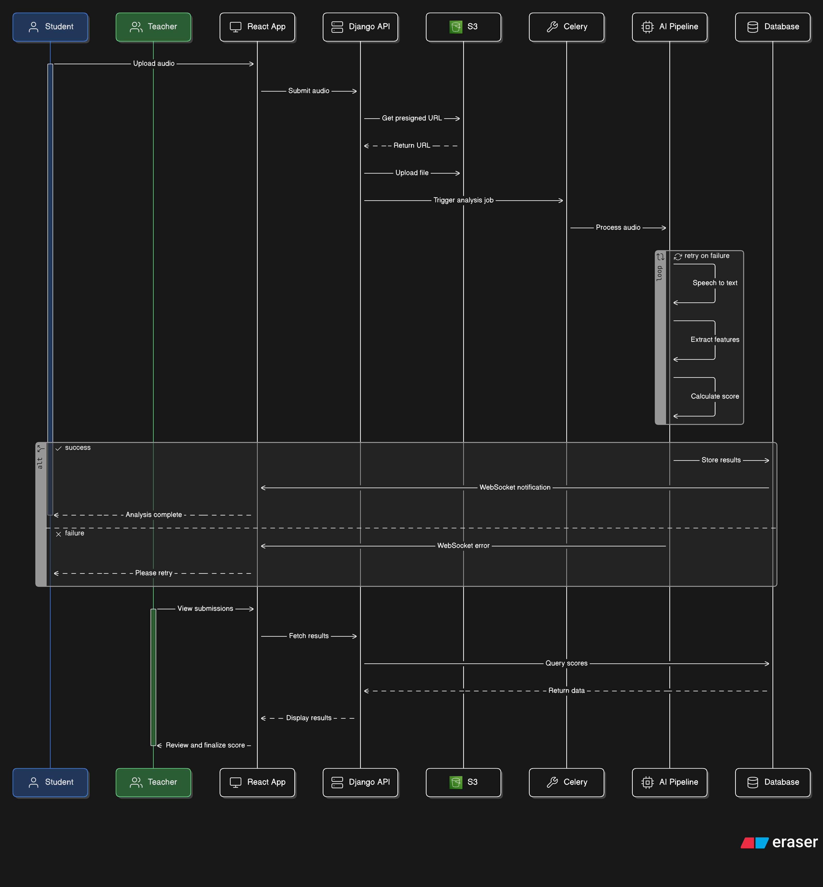
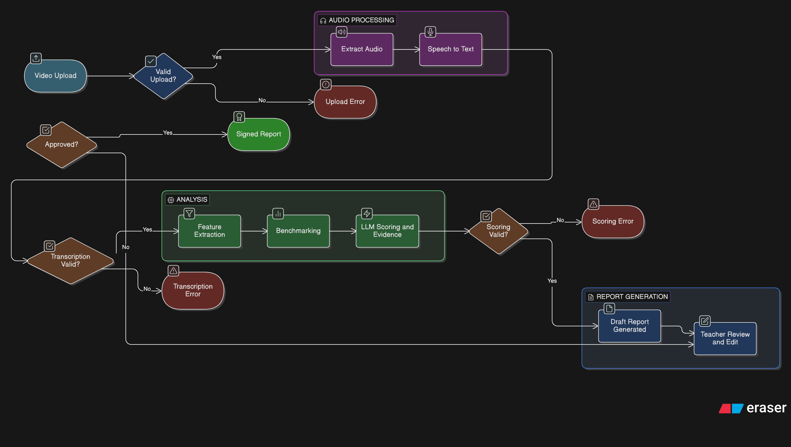

# Architecture Overview

## System Architecture Diagram



## High-Level Data Flow

### 1. Recording Upload Flow



### 2. Assessment Processing Flow


### 3. Teacher Review Flow

```
Teacher Opens ──▶  View AI Draft  ──▶  Edit Scores/  ──▶  Add Private  ──▶  Sign Off
Assessment         Report             Evidence/          Notes             (Audit Trail
                                       Feedback                           Captured)
```

## Core Components

### Frontend (React)
- **Authentication Module**: JWT-based auth with role-based access
- **Recording Component**: WebRTC-based video/audio capture
- **Dashboard**: Assessment overview, analytics, cohort views
- **Review Interface**: Side-by-side video player with editing tools
- **PDF Export**: Client-side PDF generation for reports

### Backend (Django)
- **API Layer**: Django REST Framework for all endpoints
- **WebSocket Layer**: Django Channels for real-time updates
- **Task Queue**: Celery + Redis for async AI processing
- **Admin Interface**: Built-in Django admin for data management
- **Core Apps**:
  - `users`: Authentication and authorization
  - `students`: Student profiles and cohort management
  - `assessments`: Recording metadata and workflow
  - `analysis`: AI pipeline orchestration
  - `reports`: Draft and signed report management
  - `benchmarks`: BDL versioning and scoring logic

### AI Pipeline
- **STT Service**: OpenAI Whisper API or AWS Transcribe
- **Feature Extractor**: Python library using librosa, NLTK, spaCy
- **Benchmark Engine**: JSON-based BDL interpreter
- **Evidence Generator**: Deterministic candidate selection
- **LLM Scorer**: OpenAI GPT-4o / Claude API with structured output

### Infrastructure (AWS)
- **Compute**: ECS Fargate for containerized services
- **Database**: RDS PostgreSQL (Multi-AZ)
- **Cache**: ElastiCache Redis
- **Storage**: S3 with versioning and lifecycle policies
- **CDN**: CloudFront for static assets and video streaming
- **Queue**: SQS or Redis for Celery backend
- **Monitoring**: CloudWatch, X-Ray

## Technology Decisions

### Why React + Django?
- **React**: Component reusability, strong ecosystem, excellent video/media handling
- **Django**: Rapid development, robust ORM, built-in admin, excellent Python ecosystem for ML
- **Separation**: Allows independent scaling of frontend and backend

### Why AWS?
- **AWS Transcribe**: Purpose-built for speech-to-text with timestamps
- **S3**: Industry-standard object storage with fine-grained permissions
- **ECS Fargate**: Serverless containers - no server management
- **RDS**: Managed PostgreSQL with automated backups

### AI Model Strategy
- **MVP**: Use external APIs (OpenAI, Anthropic) - faster time-to-market
- **Post-MVP**: Train custom models using collected teacher feedback data
- **Hybrid**: Keep deterministic feature extraction separate from LLM scoring

## Scalability Considerations

### Horizontal Scaling
- Stateless Django backend - can run multiple containers
- Celery workers scale independently based on queue depth
- S3 handles unlimited video storage

### Performance Optimization
- Video upload uses presigned URLs (direct to S3)
- AI processing is fully asynchronous
- Response caching for benchmark definitions
- CDN for video streaming and static assets

### Data Retention
- Video files: 7-year retention (educational records)
- Audit logs: Permanent
- AI processing artifacts: 1 year
- Soft deletes for all records (compliance)

## Security Architecture

### Data Protection
- All data encrypted at rest (S3, RDS)
- TLS 1.3 for all communications
- Video access via time-limited presigned URLs only
- No public video URLs ever

### Access Control
- Role-based: Admin, Teacher, Student, Parent (future)
- Row-level permissions (teachers only see their students)
- API key management for external services

### Compliance
- GDPR-compliant data handling
- Audit trail for all modifications
- Right to erasure support
- Data residency controls (future)
